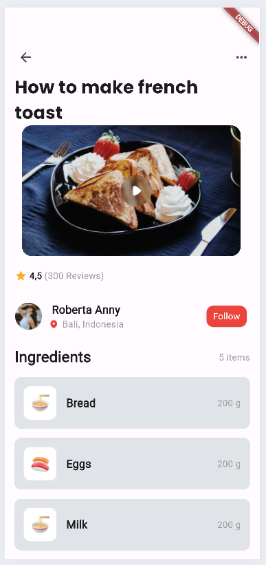

## CAPSTONE PROJECT
This Food Recipe app provides users with a platform to explore and learn various recipes. It offers a user-friendly interface to view recipe videos, read reviews, and access ingredient lists, enhancing the cooking experience for users.

## Project Details
To design the app's user interface, I combined a number of widgets and organized them into reusable components. Here's a breakdown of the implementation.

## Widgets:

### TopSection Widget
The TopSection widget is responsible for showing the top navigation bar, which includes the program title and any additional actions or icons. It promotes consistency between displays and improves navigation within the app.

### ImageSection Widget
The ImageSection widget shows the backdrop image for the recipe video. It improves the visual attractiveness of the recipe page and shows consumers a preview of the cooking process.

### RatingSection Widget
The RatingSection widget shows user reviews and ratings for the recipe. It allows users to determine the popularity and quality of a recipe based on community feedback.

### UserProfile Widget
The UserProfile widget showcases the profile image, name, and location of the user who shared the recipe. It adds a personal touch to the recipe page and fosters a sense of community among users.

### IngredientSection Widget
The IngredientSection widget lists the ingredients required for the recipe. It provides users with a comprehensive overview of the necessary items, facilitating the preparation process.

## CODEBASE
I structured the codebase to promote reusability and maintainability by organizing related widgets into separate files within the widgets folder. Here's how the code is structured:

- main.dart: Contains the main entry point of the app and configures the MaterialApp.
- widgets folder:
  - TopSection.dart: Defines the Appbar widget for the top navigation bar.
  - ImageSection.dart: Implements the video widget for displaying recipe videos.
  - Ratings.dart: Includes the Reviews widget for showcasing user reviews and ratings.
  - UserProfile.dart: Defines the UserProfile widget for displaying user profiles.
  - IngredientSection.dart: Contains the IngredientSection widget for listing recipe ingredients.

## GIT
- Cloned the repository to my local machine to work on my solution.
- Implemented features and Committed changes at meaningful points, such as after adding each widget or feature.
- Pushed branches to the remote repository.

## Solution Screenshots 
Here is a screenshot of my solution 
